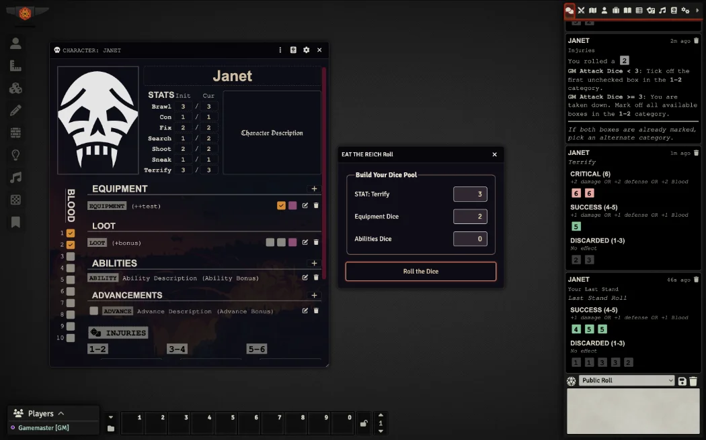
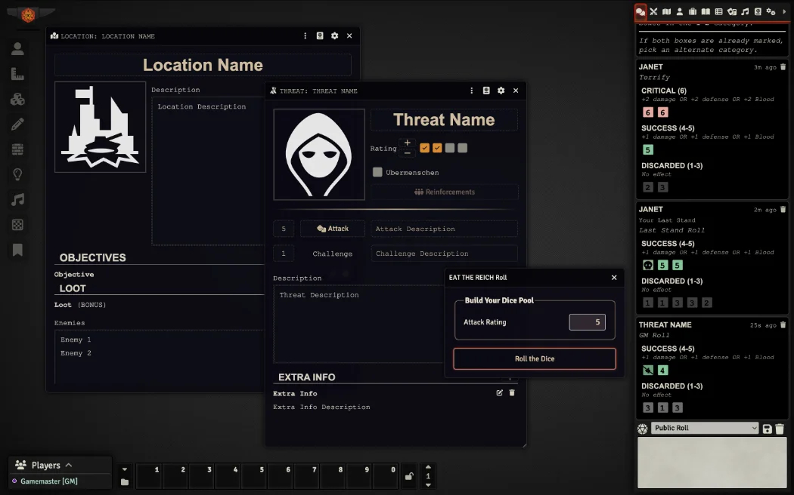

# An EAT THE REICH System (Unofficial)

    
     
     
    
    

     
     
     
    

   	

### An Unofficial EAT THE REICH System for Foundry VTT
EAT THE REICH is a chaotic, ultraviolent tabletop RPG where players take on the roles of vampiric commandos on a bloody mission to tear through Nazi-occupied France during World War II. Written by [Grant Howitt](https://bsky.app/profile/gshowitt.bsky.social) and illustrated by [Will Kirkby](https://bsky.app/profile/chamonkee.bsky.social), and published by [Rowan, Rook and Decard](https://rowanrookanddecard.com). The game blends pulpy action, dark humor, and horror as players use their supernatural abilities to slaughter Nazis and consume their blood. With fast-paced mechanics and a rebellious tone, EAT THE REICH delivers an over-the-top, cathartic power fantasy drenched in gore and irreverence.

Find the books here: 
[EAT THE REICH](https://rowanrookanddecard.com/product-category/game-systems/eat-the-reich)

This Eat the Reich Package for Foundry VTT is an independent production by Joseph Hopson (ephson) and is not affiliated with Rowan, Rook and Decard or Will Kirkby. It is published under the RR&D Community License.

If you’ve enjoyed my work and find value in what I create, please consider supporting me with a small donation on [Ko-fi](https://ko-fi.com/G2G3I91JQ). I truly love what I do, and your support helps me dedicate time and resources to ongoing development. Every contribution, no matter the size, makes a difference and allows me to continue doing what I’m passionate about. Thank you for considering—it means the world to me.

## Screenshot

<!-- 
 -->

## How to Install
You can install the latest released version of the system by using this manifest link in Foundry VTT. [Instructions](https://foundryvtt.com/article/tutorial/): [module.json](https://github.com/philote/eat-the-reich/releases/latest/download/module.json)

## Features
- Character Sheet

### TODO
- Dice Rolling support
- NPC Sheet
- Compendiums
    - Pre-gens
    - Pre-gen Items
- Paris Scene
- Play/Edit mode for character sheets

# License & Acknowledgements
The ‘Eat The Reich’ game is copyright © 2023 Rowan, Rook and Decard. All artwork in the game is copyright © 2023 Will Kirkby. You can find out more and support these games at [rowanrookanddecard.com](https://rowanrookanddecard.com)

https://rowanrookanddecard.com/rrd-community-licence